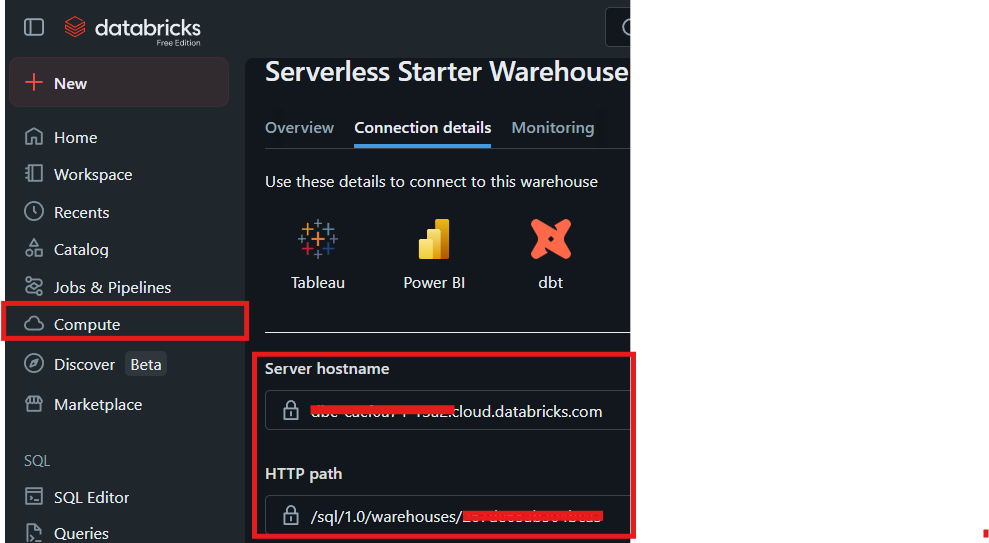
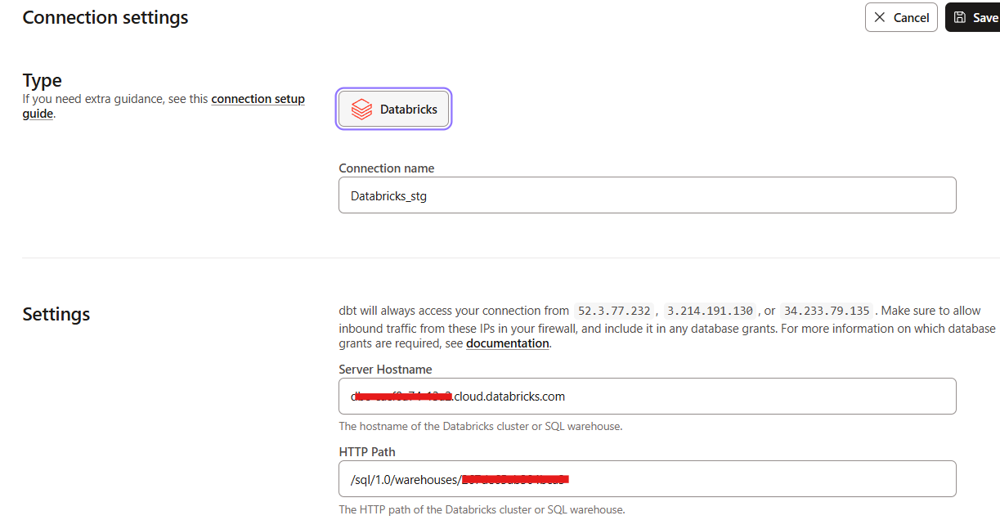
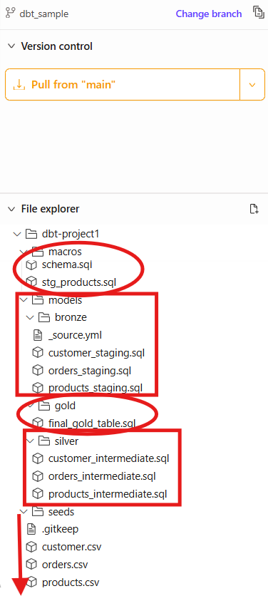
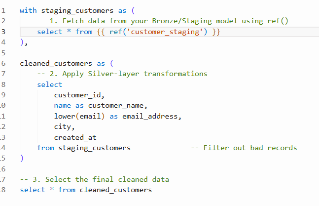
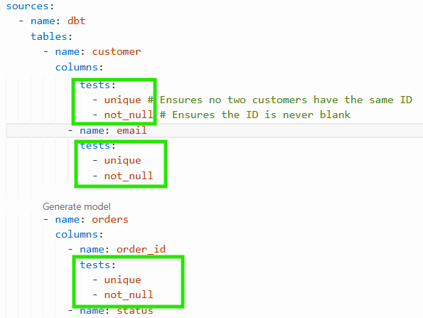
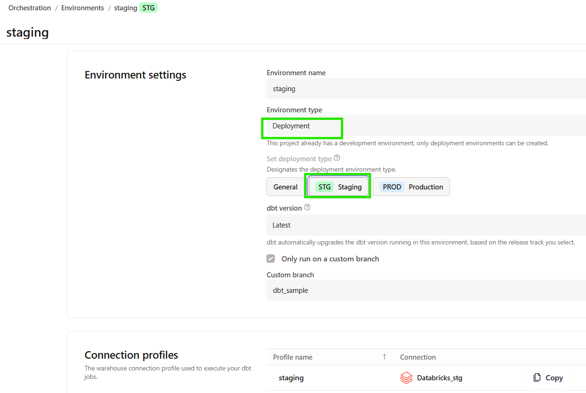
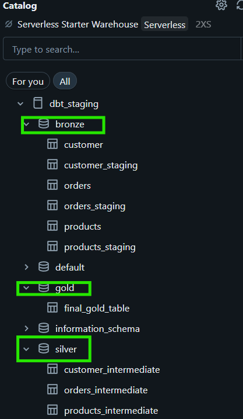
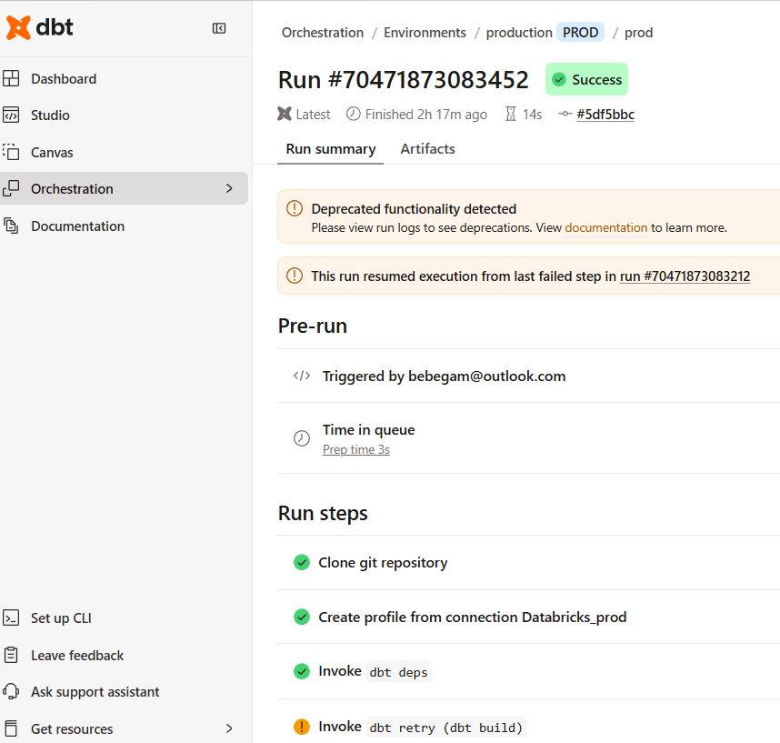

# 📌DBT - Technical Deep Dive

🏗️ Building Scalable Data Pipelines: dbt + Databricks Medallion Architecture

Just completed a comprehensive implementation of the Medallion Architecture using dbt Cloud and Databricks—and here's exactly how I did it:

---

## 📋 **Prerequisites**

Before diving in, you'll need:
✅ Databricks account with Unity Catalog enabled
✅ dbt Cloud account (free tier works!)
✅ GitHub repository for version control
✅ SQL & dbt basics understanding
✅ Databricks SQL Warehouse up and running

---

## 🔧 **Step 1: Connect dbt Cloud to Databricks**

This is the foundation—every transformation runs through this connection.

1. **Gather Databricks Credentials:**
   - Server Hostname (from SQL Warehouse connection details)
   - HTTP Path (from Databricks)
   - Personal Access Token (User Settings > Developer > Access Tokens)

2. **Configure in dbt Cloud:**
   - Go to Account Settings > Projects > Create New Project
   - Select Databricks as your adapter
   - Paste credentials into connection form
   - Test the connection ✅

3. **Set Development Schema:**
   - Define your development sandbox (e.g., `dbt_dev`)
   - This is where you'll test models safely





---

## 🏗️ **Step 2: Set Up Project Folder Structure**

Organization matters—it forces discipline and clarity.

Create this structure in your GitHub repo:
```
models/
├── bronze/        # Raw 1-to-1 copies (no transformations)
├── silver/        # Cleaned, standardized data
├── gold/          # Business-ready aggregations
├── sources.yml    # Source definitions & freshness checks
└── schema.yml     # Test definitions & documentation

macros/
├── schema.sql     # Custom schema routing macro
└── utilities.sql  # Reusable transformation functions

seeds/
├── customer_codes.csv
├── product_categories.csv
└── ...
```



---

## 🛠️ **Step 3: Implement the Medallion Architecture**

### **Bronze Layer: Raw Data (1-to-1 Copy)**
```sql
-- models/bronze/stg_customers.sql
select * from {{ source('raw_data', 'customers') }}
```
**Purpose:** Preserve original data as-is. No transformations, no filtering.

### **Silver Layer: Clean & Standardized**
Data gets cleaned, deduplicated, and cast to proper types.



**Example transformations:**
- Convert email to lowercase
- Fix date formats
- Handle null values
- Remove duplicates

### **Gold Layer: Business-Ready**
Create fact tables, dimensions, and aggregations optimized for analytics.

---

## 🧪 **Step 4: Build Quality Assurance**

This is what separates production systems from experiments.

Define tests in `schema.yml`:



**Test Types:**
- **Uniqueness:** No duplicate customer IDs in gold table
- **Non-null:** Critical columns can't be blank
- **Accepted Values:** Status field only contains 'pending', 'approved', 'rejected'
- **Referential Integrity:** Every order_id exists in orders table

---

## 🚀 **Step 5: Set Up Staging & Production Environments**

### **Staging Environment:**
1. In dbt Cloud > Deploy > Environments
2. Create "staging" environment (Deployment type)
3. Point to `dbt_staging` catalog/schema
4. Enable "Run on Pull Requests"



This ensures every code change is tested before production.

### **Production Environment:**
1. Create "production" environment
2. Point to `dbt_prod` catalog/schema
3. Set daily schedule (or manual trigger)
4. Enable source freshness checks

---

## 🔄 **Step 6: Automate with Jobs**

Create a job that runs end-to-end:


**Job Execution Order:**
1. `dbt source freshness` → Validate raw data arrived
2. `dbt deps` → Install dependencies
3. `dbt seed` → Load static reference data
4. `dbt build` → Run all models + tests
5. `dbt docs generate` → Update documentation

**Run Frequency:**
- Staging: On every Pull Request
- Production: Daily at 2 AM UTC

---

## ✨ **The Result**

After implementing these steps, you'll have:



**What this achieves:**
- 🔄 Automated data pipeline (no manual processes)
- 🧪 Built-in quality assurance (tests catch 99% of issues)
- 📊 Clear data lineage (dependencies fully mapped)
- 🛡️ Version controlled transformations (every change tracked)
- 🚀 Governance-first architecture (Unity Catalog integration)
- 📈 Production-ready system (tested before deployment)

---

## 💡 **Key Learnings**

The real power isn't just the tech stack—it's the *discipline* it enforces:



- Data lineage & dependencies become crystal clear
- Testing & validation catch issues early
- Separation of concerns (bronze/silver/gold) ensures governance
- Version control + documentation are mandatory, not optional
- Automation eliminates manual data tasks

**This is where the real value lies.**

---

## 🎯 **Ready to Build?**

If you're thinking about implementing a data pipeline, this Medallion Architecture + dbt + Databricks combo is genuinely powerful. You get enterprise-grade data governance without enterprise-grade complexity.

**Are you already using dbt in production? I'd love to hear about your architecture and lessons learned! 🤔**

#DataEngineering #dbt #Databricks #MedallionArchitecture #DataGovernance #Analytics #CloudData #SQLTransformation
